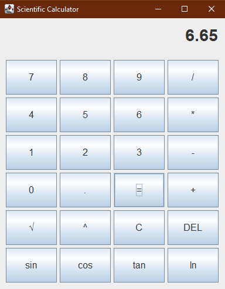

# Scientific Calculator (Java Swing)

#### A modern GUI-based scientific calculator built in Java using Swing.

---

## 🚀 Features

- **Basic operations:** `+`, `-`, `*`, `/`, `%`, `^`
- **Scientific functions:** `√`, `sin`, `cos`, `tan`, `ln`
- **Expression parsing** (multi-operand support)
- **Trigonometric inputs** in degrees
- **Real-time error handling**
- **Smooth and styled GUI**

---

## 📁 How to Run

```
javac src/calcPac/CalcGUI.java  
java -cp src calcPac.CalcGUI
```

---

## 📷 Screenshot




---

## 👤 Author

Made by Himanshi Sharma  
Feel free to fork, use, and contribute!
